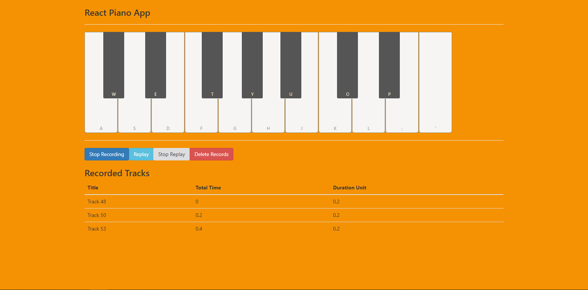

This project was bootstrapped with [Create React App](https://github.com/facebook/create-react-app).

##For running this
I have used `yarn` instead of `npm`. So kindly follow yarn role for this projects.
First you need to install all node modules `yarn install` and then you could run the project by the following command

### `yarn start`
Runs the app in the development mode. 
Open [http://localhost:3000](http://localhost:3000) to view it in the browser.

Please see the screenshot to see the view.

